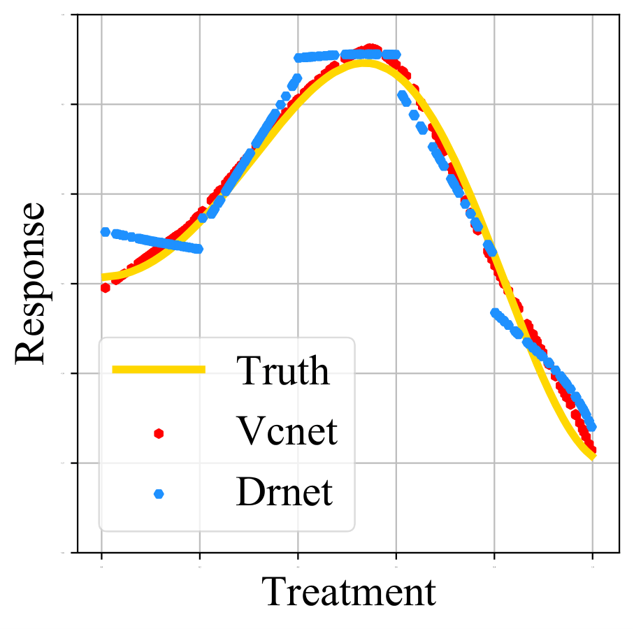

# Varying Coefficient Neural Network with Functional Targeted Regularization for Estimating Continuous Treatment Effects
\[ICLR 2021, Oral Presentation\] Code for: [Varying Coefficient Neural Network with Functional Targeted Regularization for Estimating Continuous Treatment Effects](https://openreview.net/forum?id=RmB-88r9dL)

We investigate the problem of estimating the average dose-response function (ADRF) with neural network model. We develop a new network architecture called varying coefficient network that is powful in representing the treatment effect while preserving the continuous structure of ADRF. To improve finite sample performance, we generalize targeted regularization to obtain a doubly robust estimator of the whole ADRF curve.

A typical comparison of estimated ADRF with a previous model is as follows.

</img>

## How to run

To run the experiment with simulated data:

-- generate simulated data

    simu1_generate_data.py

-- train and evaluating the methods

To run a singe run of models/methods with one dataset. You can also use it to generate estimated ADRF curve (Fig 1 in the paper):
    
    main.py

To run all models/methods with numbers of datasets, please use

    main_batch.py

Some sample command to produce our experiment.
    
    run.sh
   
To run the experiment with ihdp and news data: See the example command in `run.sh`.    

## Citation
    @inproceedings{
    nie2021varying,
    title={Varying Coefficient Neural Network with Functional Targeted Regularization for Estimating Continuous Treatment Effects},
    author={Lizhen Nie and Mao Ye and qiang liu and Dan Nicolae},
    booktitle={International Conference on Learning Representations},
    year={2021},
    url={https://openreview.net/forum?id=RmB-88r9dL}
    }
